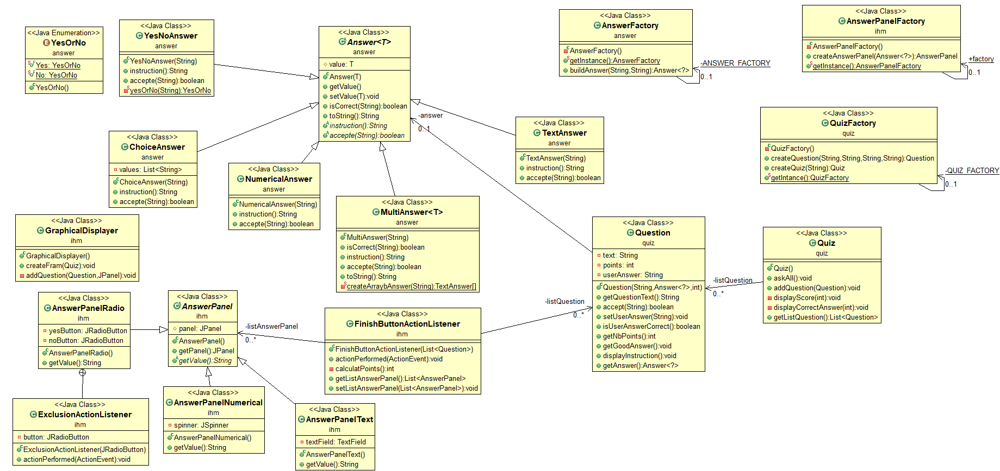

# Project Quiz

## Introduction
 - The project is a quiz game. A quiz game contains severals questions, which be can several kinds of answers (it could be a textual one, a numercial one, a Yes/No question, a multi-choice or a chooser one).
The game consist to answer all of these questions correctly (or not), and obtain points each time you answered right. So try to have a perfect one !

## How to:

### 1- Get the project

 - `git clone https://gitlab-etu.fil.univ-lille1.fr/despelchin/despelchin-pereira-coo.git` and go to the quiz project's location.
 - `cd despelchin-pereira-coo/TP3-Questionnaires`

### 2- Generate the documentation

 - `mvn javadoc:javadoc`

### 3- Generate the project

 - `mvn package`

### 4-  Execute the archive

 - `java -jar ./target/TP4-Questionnaires-1.0-SNAPSHOT.jar` and add in argument `Graphical|Console`

## Insights

### 1- Important conception elements

- As required on the COO courses, we split the code as possible, to have a better adaptability of it.
- We have 3 factories designed to generate the quiz.

### 2- Design patterns presentation 

We used
- 3 Factories:
    -  One for the generating the Quiz himself.
    -  One for generating the answers.
    -  One for generating the IHM-sided answers.
- 3 Singleton, one for each instance of the factories.

### 3- Project valorisation
We have 2 launching prossibilities, one on a console-side and the graphocal one, as requested on the subject.
We have the best questions too :)

### 4- UML of the project

## Authors
Made by Nicolas Pereira & Brice Despelchin, for the COO courses at the "Université de Lille".
All rights reserved.

